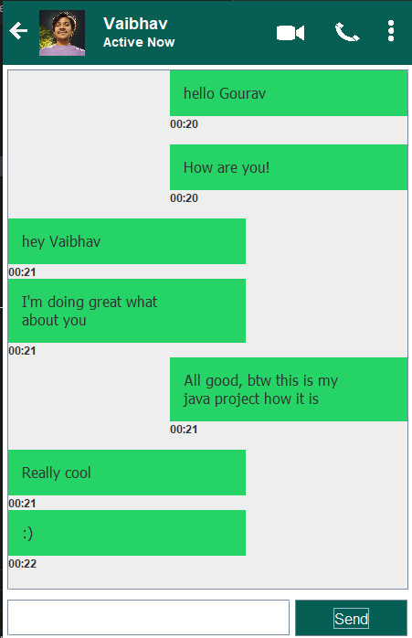
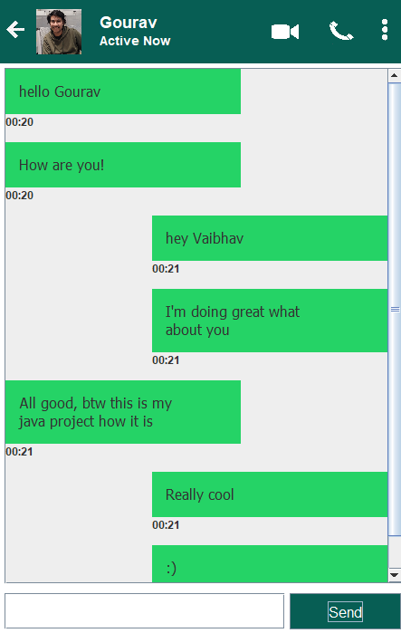
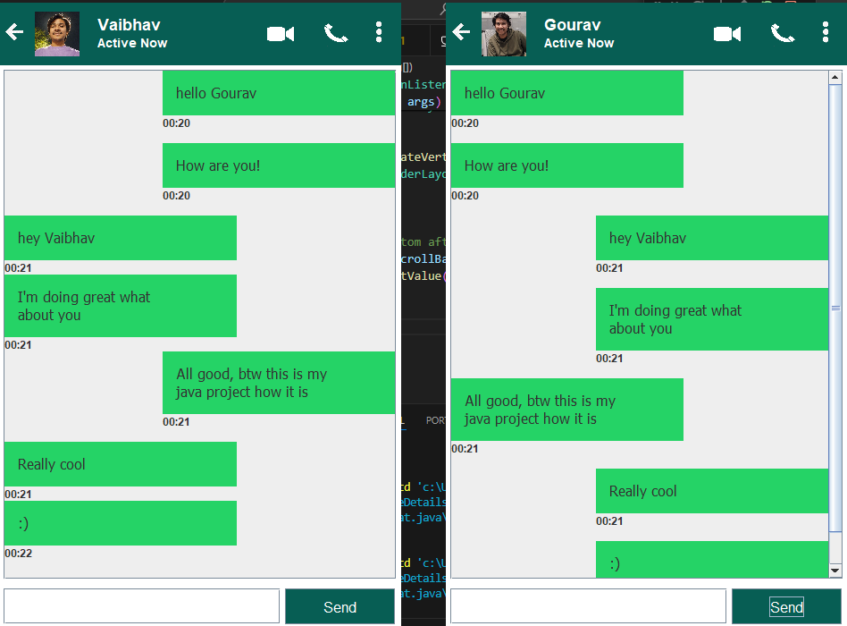

<body>
    

        <h1>Chatoipa</h1>
        <h2>Simple Chat Application</h2>
        
This is a simple chat application built in Java using Swing for the GUI. It consists of a server and client component allowing two users to exchange messages in real-time.

                <h2>Features</h2>
        <ul>
            <li>Allows two users to chat in real-time.</li>
            <li>User-friendly graphical interface using Swing.</li>
            <li>Messages are displayed with timestamps.</li>
        </ul>
        <h2>Installation</h2>
        <ol>
            <li>Clone the repository to your local machine:</li>
            <pre><code>git clone https://github.com/yourusername/your-project.git</code></pre>
            <li>Open the project in your preferred Java IDE (e.g., IntelliJ IDEA, Eclipse).</li>
            <li>Compile and run the <code>Server</code> class to start the server.</li>
            <li>Compile and run the <code>Client</code> class to start the client application.</li>
        </ol>
                <h2>Usage</h2>
        <ol>
            <li>Launch the server application first.</li>
            <li>Launch the client application and connect to the server by entering the server IP address.</li>
            <li>Start chatting!</li>
        </ol>
      <h2>Screenshots</h2>
        
Screenshots of the application are given here to give users a visual preview.

        
        
         
    
  <h2>Contributing</h2>
        
Pull requests are welcome. For major changes, please open an issue first to discuss what you would like to change.

    

</body>
</html>
